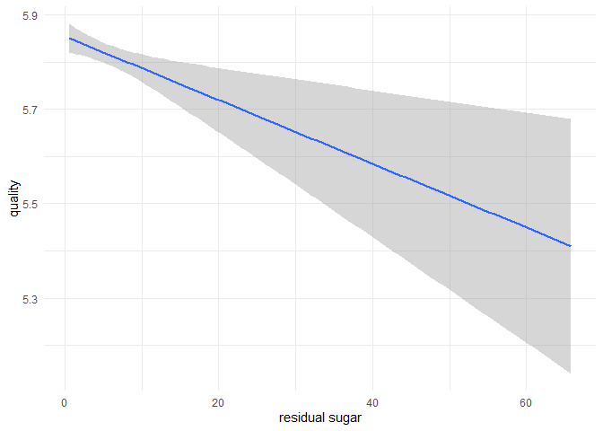
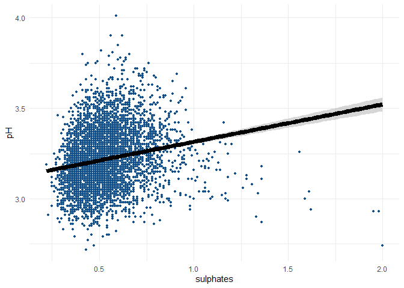
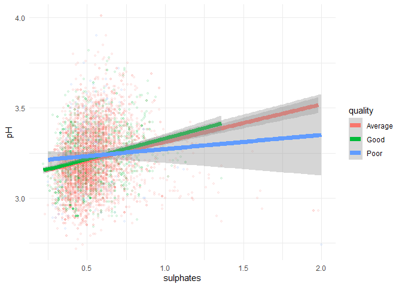
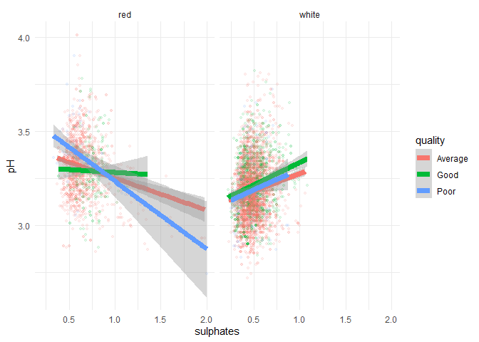
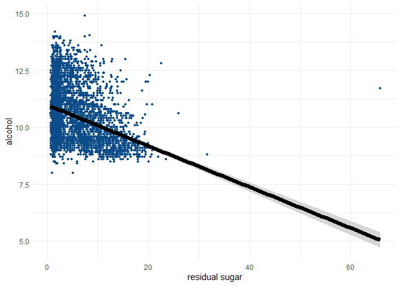
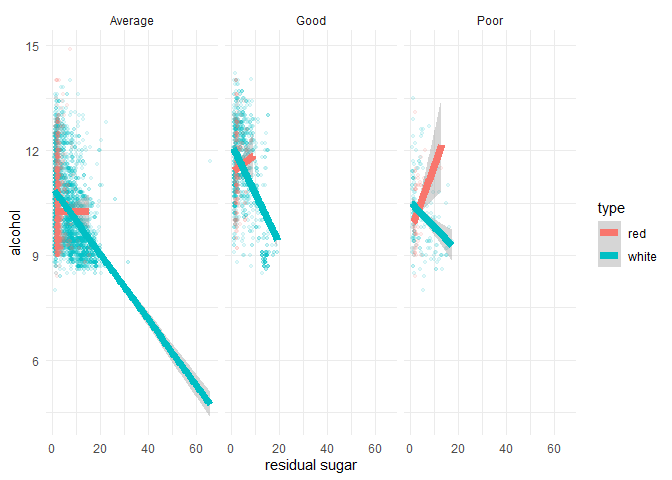
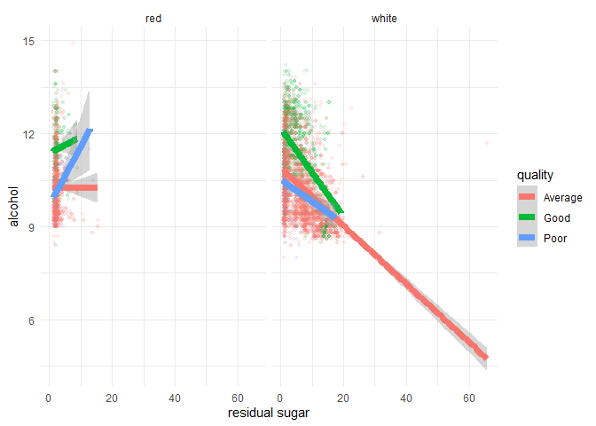
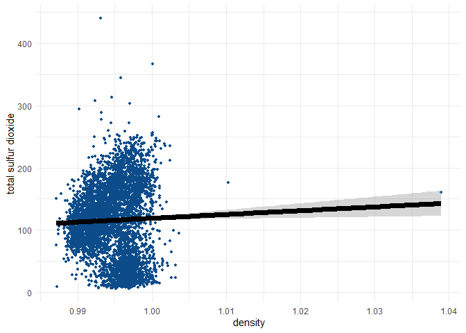
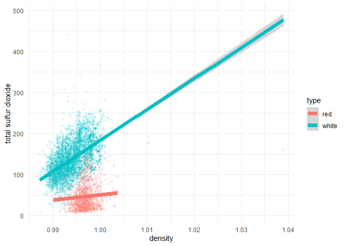
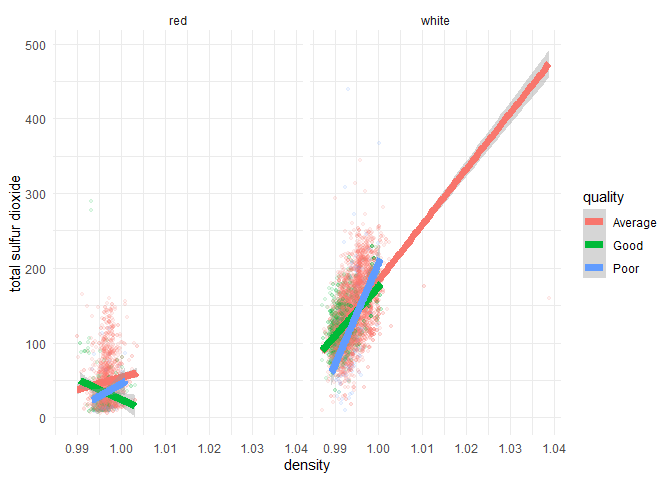

# Confounding Variables with Wine Quality 

[R-Code](https://github.com/Billy-j0/Wine_quality_analysis/blob/main/winequality_analysis.Rmd)

[Data-set](https://github.com/Billy-j0/Wine_quality_analysis/tree/main/Datasets)

## Introduction

Confounding variables (also known as lurking variables) are essentially
factors that affect both the dependent and independent variables.
Failing to account for these confounders could lead to incorrect
conclusions when doing analysis for the dataset.

To illustrate a basic example, I look at data concerned with a commodity
that certainly had its share of consumption growth during the quarantine
period: Wine.

## About the dataset

This excersise will assess confounding in the Wine quality Datasets
taken from [Kaggle](https://www.kaggle.com/rajyellow46/wine-quality).
The datset contains the chemical properties of red and white variants of
the Portuguese “Vinho Verde” wine. These chemical properties play a
vital role in determining the quality of Wine.

``` r
winequalityN <- read_csv("winequalityN.csv")
```

The dataset contain 6,497 observations with 13 variables which indicate
the Wine quality for both Red and White type. Here is some description
about the data: - **type**: This column indicates the wine type,
including red and white.

-   **fixed.acidity**: This column is most acids involved with wine or
    fixed or nonvolatile.

-   **volatile acidity**: The amount of acetic acid in wine which at
    this column is too high of levels can lead to an unpleasant. This
    means is wine contains the high vinegar taste.

-   **citric acid**: When found in small quantities, citric acid can add
    ‘freshness’ and ‘flavor’ to wines.

-   **residual sugar**: The amount of sugar remaining after fermentation
    stops. It’s rare to find wines with less than 1 gram/liter. Wines
    with greater than 45 grams/liter are considered sweet.

-   **chlorides**: This column gives the amount of salt in the wine.

-   **free sulfur dioxide**: The free form of SO2 exists in equilibrium
    between molecular SO2 (as a dissolved gas) and bisulfite ion; it
    prevents microbial growth and the oxidation of wine.

-   **total sulfur dioxide**: Amount of free and bound forms of S02.
    This amount in low concentrations, SO2 is mostly undetectable in
    wine, but at free SO2 concentrations over 50 ppm, SO2 becomes
    evident in flavour of smell and taste of wine.

-   **density**: This column gives the density. The density of water is
    close to that of water depending on the percent of sugar and alcohol
    content.

-   **pH**: This column gives the amount of acid or wine basic.
    Describes how acidic or basic a wine is on a scale from 0 (very
    acidic) to 14 (very basic). Most of wines are between 3\*4 on the pH
    scale.

-   **sulphates**: This column gives the amount of sulphates of contains
    in wine. A wine additive which can contribute to sulphur dioxide gas
    (S02) levels, which acts as an antimicrobial and antioxidant.

-   **alcohol**: This column gives the amount the percent content of
    alcohol in the wine.

-   **quality**: This column gives the quality of the wine. Output
    variable; based on sensory data, scores between 0 and 10. This
    means, 0 is poor quality and 10 is high quality.

## The approach

In order to assessing the cofounding variables in this dataset, I have
come up with 2 different approaches:

1.  **Assumption Approach**: My personal assumptions about correlation
    of Wine quality.

2.  **Correlation Matrix**: Using correlation matrix to identify which
    variables are highly correlated to each other.
    

## Assumption Approach

### The lower the sugar, the better the wine?

➡️ By plotting ‘wine quality’ with ‘residual sugar’, I find out that as
sweetness level goes up, the quality of the wine actually diminishes.



➡️ Before I readily assume that wine drinkers would always prefer liquor
that’s completely devoid of sweetness, I first have to consider if there
are confounding variables that would affect my analysis.

➡️ An obvious one that’s available in my dataset is of course the type of
wine.

### White Wine vs Red Wine

➡️ If I produce the same plot but split by the type of wine, I discover
that my premature conclusion is incorrect. It turns out that perception
of quality *improves* with sweetness for red wine, while the inverse is
true only for white wine.


## Correlation Variables

➡️ The quality variable has been converted from numeric to Categorical data
type as per the below mentioned conversion standard :

-   Quality 3-4 : Poor
-   Quality 5-6 : Average
-   Quality 7-9 : Good

``` r
winequalityN$quality <- ifelse(winequalityN$quality <= 4, "Poor", 
ifelse(winequalityN$quality <= 6, "Average", "Good"))
```

### Sulphates - PH

➡️ The below plot shows that Sulphates and PH have a positive correlation.
It can be seen that as the Sulphates increases the PH value also
increases.



➡️ Further grouping by wine quality also shows the same positive
correlation being maintained across all levels of wine quality.



➡️ Howevever on further grouping by wine type, it can be seen that white
wine still maintains a positive correlation between Sulphates and PH
across all quality levels, but red wine has a negative relationship as
PH decreases with increase in Suplahtes for all quality levels.




### Residual Sugar - Alcohol

➡️ The below plot shows that Residual Sugar and Alcohol have a negative
correlation. It can be seen that as the residual sugar increases the
alcohol decreases.



➡️ After taking into account the wine type and quality, I observe the below
changes in the relationship:

➡️  For all levels of wine quality, the relationship between residual
    sugar and alcohol remains negative for white wine but however for
    red wine there is a positive relation as alcohol increases with rise
    in residual sugar.




➡️  Across all levels of wine quality the relationship between residual
    sugar and alcohol remains negative.


➡️ However on further grouping by wine type it can be observed that white
wine still maintains a negative relationship across all levels of wine
quality while red wine maintains a positive relationship between
residual sugar and alcohol across all quality levels.



### Density - Total Sulfur Dioxide

➡️ The below plot shows that Density and Total Sulfur Dioxide have a
positive correlation. It can be seen that as the density increases the
total sulfur dioxide also increases.



➡️ Grouping by wine type it can be seen that both red and white wines
maintain a positive relationship between density and total sulfur
dioxide.



➡️ On further grouping the wine types by wine quality levels, shows that
white wine maintains a positive relation between density and total
sulfur dioxide across all quality levels, however red wine maintains a
positive collinearity for Poor and average quality levels whereas for
Good quality level the correlation is negative as total sulfur dioxide
decreases with increase in density.

    ## `geom_smooth()` using formula 'y ~ x'



# Conclusion

➡️ In the above data analysis, Wine quality levels and wine type have been
identified as confounding variables as they change the
correlation(results) between different chemical properties by
introducing bias and increasing variance when considered. Thus when
woking on multivariate relationships it is important to identify and
consider these variables when modelling.
